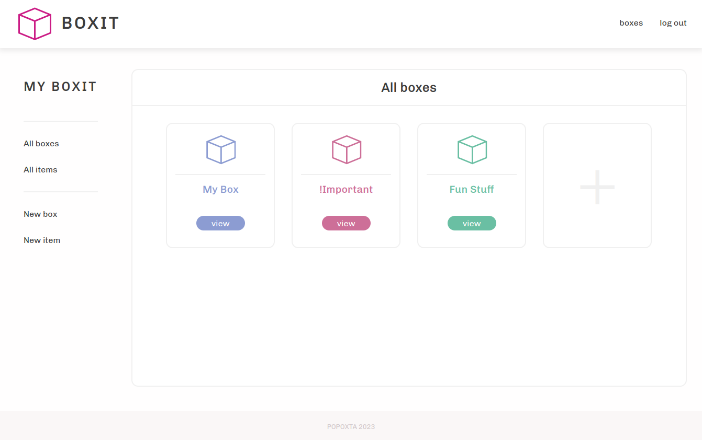

# BOXIT Inventory System

### Store your items in boxes 📦

A Box / Item inventory management tool, featuring CRUD operations, image upload, DB integration (MongoDB), session-based
authorization, and it's very own API.


### Learning Outcomes

My learning outcomes for this project were to create fully fleshed out application with a connected backend.
<br>
I thoroughly enjoyed working on the backend, and wish to do more in the future - I especially found working with
endpoints and middleware particularly fun!
Implementing user authentication was an absolute blast - however CORS did give me a touch of struggle!

Feel free to check out my design file in FIGMA linked below - I've even kept in my very high-level 'pseudocode' for a
bit of insight to my implementation process.

### Tools used

-

Figma - <a href="https://www.figma.com/file/LaPIpEsTw8hk4v4pegXzFm/Boxit?type=design&node-id=0%3A1&t=8x2bcLGjHkuHKWj0-1">
SOURCE</a>

- React / <a href="https://vitejs.dev/">Vite</a>
- <a href="https://www.npmjs.com/package/react-router">React Router</a>
- <a href="https://www.npmjs.com/package/modern-normalize">Modern Normalize</a>

- NodeJS / <a href="https://www.npmjs.com/package/express">Express</a>
- MongoDB / <a href="https://www.npmjs.com/package/mongoose">Mongoose</a> (ODM)
- <a href="https://www.npmjs.com/package/bcrypt">BCrypt</a> / <a href="https://www.npmjs.com/package/passport">
  PassportJS</a> / <a href="https://www.npmjs.com/package/express-sessions"> Express-Sessions</a>
- <a href="https://www.npmjs.com/package/multer">Multer</a> / <a href="https://www.npmjs.com/package/cors">cors</a>

### What's left?

- Building, refining & hosting
- Better Mobile compatibility (CSS)

### Want to try out BoxIt?

This is currently a manual and basic implementation in development mode.
BoxIt may be properly built in the future, until then you may run it locally in development mode as per the instructions
below.

1. Clone the Repo locally
2. Run the following commands within the root directory
    ```
   cd webapp/; npm install; touch .env; echo "VITE_URL= http://localhost:3000" >> .env;
    cd ..
    cd api/; npm install; touch .env; echo "MONGO_STORE=YOUR_MONGO_CONNECTION_STRING" >> .env ; echo "SECRET=YOUR_SECRET" >> .env;
    cd ..
   ```
3. Insert your MongoDB connection string and secret into the .env within api
4. Run the following commands in separate terminal instances
    ```
   cd api/; nodemon app
   cd webapp/; npm run dev
    ```

### More Screenshots




